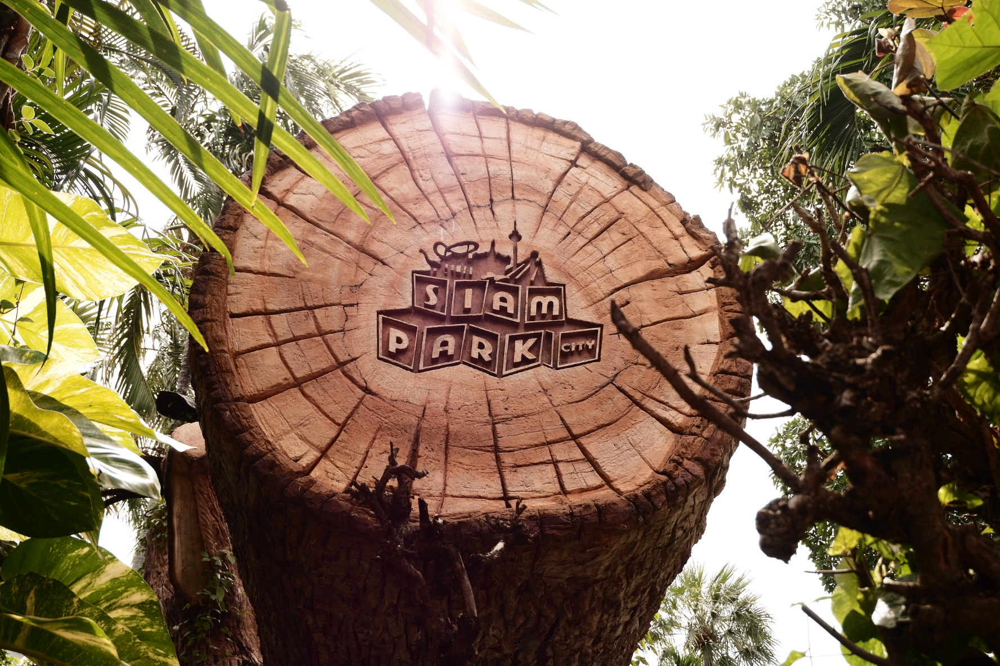
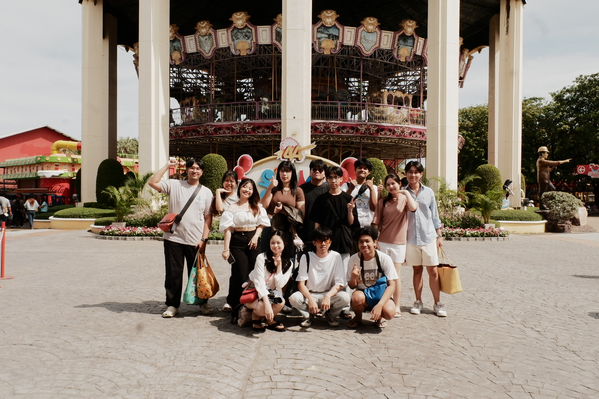

#   
### **PONGPIPAT KUMCHOO**  
---

## 🔑 My Info  
👨‍💻 **Nickname:** Base, Based  
🗣️ **สวัสดีครับ!** ผม "เบท" ครับ  
📍 **Origin:** สมุทรปราการ, ตอนนี้มาเรียนที่ศรีราชา  
🤖 **About Me:** ผมไม่ค่อยชอบเขียนโค้ดเท่าไหร่ ไม่ชอบ font-end แต่สามารถทำได้บ้างครับ 😅  
🌐 **Tech Interest:** ชอบถ่ายรูป (ตอนนี้เริ่มทำ Adobe Stock)  
📸 

---

## 🌱สิ่งที่สนใจ  
🖼️ **AI Generation**: ตอนนี้สนใจการเจนภาพจาก [MidJourney](https://www.midjourney.com/) และ [ComfyUI](https://github.com/comfyanonymous/ComfyUI)  
🔑 **API Key**: ถ้าอาจารย์มี API Key ของ OpenAI ให้ยืมจะดีมากครับ เพราะจะเอามาทำ metadata, CSV ลงภาพ  
📧 **Contact**:  
- Email: pongpipat.k@ku.th  
- Email (อื่นๆ): pongpipat.kumchoo@gmail.com

---

## 🔑 **Keyword**  
[Glossary](classification.md)

## 🤝 **Partner**  
[NATTANUN](https://tnattanun.github.io/)

---

## 📷 ตัวอย่างภาพที่ผมถ่าย  
  
  
  
  

---

## ✨ Tools & Technologies  
Here are some of the tools and technologies I use:  
🖥️ **Languages & Tools:**  
- Python  
- JavaScript  
- C
- Adobe Photoshop  
- Adobe Lightroom

🛠️ **Other Tools:**  
- GitHub  
- VS Code  
- MidJourney  
- ComfyUI

