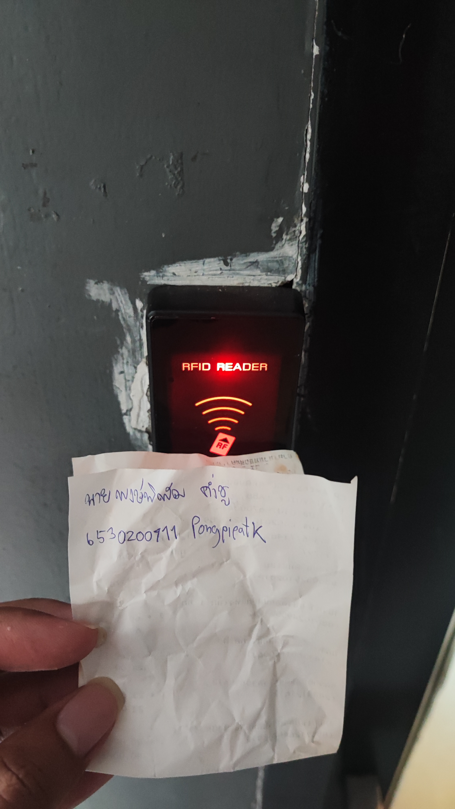

# Security-Control  
## RFID Door Lock
- **Location** : ประตูทางเข้าติดลิฟท์ เคนชิงตันตึก A
- **Control Function** : Preventative
- **Type of Security Control** : Physical Control

### เป็น Physical Control เพราะ
- เป็นอุปกรณ์ที่ติดตั้งบนประตู ทำหน้าที่เป็นกำแพงกายภาพที่ช่วยป้องกันบุคคลที่ไม่ได้รับอนุญาตจากการเข้าถึงพื้นที่
- ช่วยป้องกันการเปิดประตูด้วยวิธีการแบบดั้งเดิม เช่น การงัดแงะหรือใช้กุญแจปลอม
- ป้องกันบุคคลที่ไม่ได้รับอนุญาตไม่ให้เข้าถึงสถานที่สำคัญ

### เป็น Preventative Control เพราะ
- ป้องกันการเข้าถึงที่ไม่ได้รับอนุญาตล่วงหน้า จะช่วยให้เฉพาะบุคคลที่มีบัตร RFID ที่ได้รับอนุญาตเท่านั้นสามารถเข้าถึงพื้นที่ได้
- ลดโอกาสการเกิดเหตุการณ์ที่ไม่พึงประสงค์ ช่วยป้องกันการเข้าถึงพื้นที่สำคัญ เช่น คอนโด หรือพื้นที่ส่วนตัว
- ผู้ดูแลระบบสามารถกำหนดสิทธิ์การเข้าถึงได้ เช่น การตั้งค่าบัตรสำหรับลูกบ้าน
